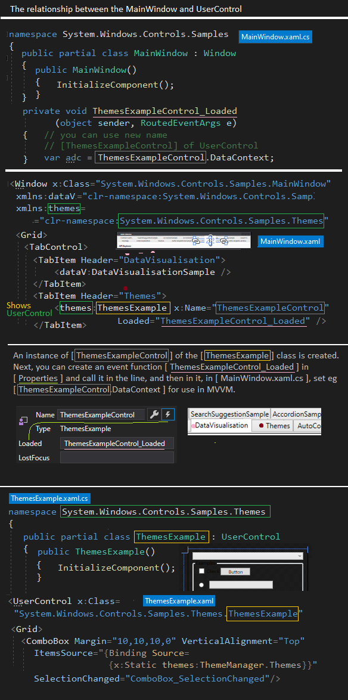

# WPF MVVM BarChart
A simple WPF application with MVVM pattern with a bar chart

The application contains a database 'Months' in the form of an ObservableCollection list. Using the MVVM pattern, the list is connected to view elements. Changing an entry in the DataGrid table view changes the data in the 'Months' list and automatically feedbacks in the bar chart.

## Details
VS2017 and Target Framework: .NET Framework 4.6.1

I have also included below a similar graphical illustration of the relationship between the main window and UserControl from where the application mechanism starts.

 

